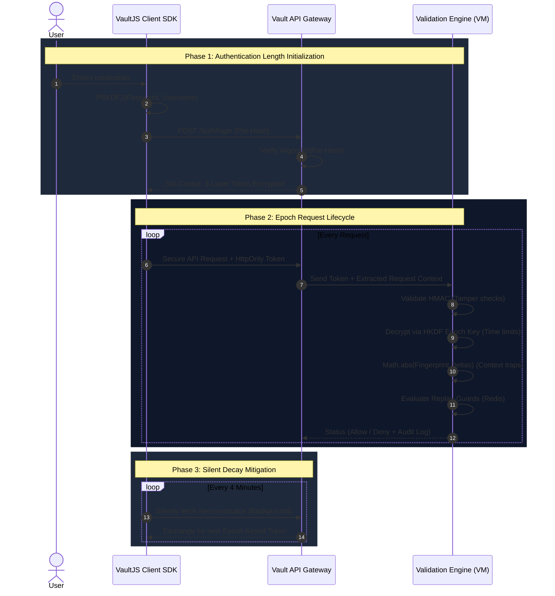

<div align="center">

# VaultJS
### The Next-Generation 4D Web Security Architecture

[](https://opensource.org/licenses/MIT)
[](https://nodejs.org/)
[](#)
[](#)

<p align="center">
  <i>A radically hardened, <b>Denuvo-inspired token architecture</b> that fundamentally changes how web sessions are defended against hijacking, cracking, and replay attacks.</i>
</p>

[**Core Concepts (4D)**](#-the-core-concept-the-4d-cryptographic-landscape) •
[**Deep Dive**](#-architecture-deep-dive) •
[**System Flow**](#-full-system-flow) •
[**Roadmap**](#-roadmap-the-path-to-zero-trust) •
[**Quick Start**](#-getting-started)

</div>

<br/>

## The Core Concept: The "4D" Cryptographic Landscape

Web security traditionally relies on 1D or 2D security (token entropy + HTTPS). These paradigms assume the environment is safe. **VaultJS assumes the environment is actively compromised.** We introduce a genuinely novel design space that maps four distinct dimensions to concrete, resilient cryptographic primitives to actively defend session state.

| Dimension  | Metaphor                              | Defense Mechanism                                 | Cryptographic Implementation                                                                                            |
| :--------: | :------------------------------------ | :------------------------------------------------ | :---------------------------------------------------------------------------------------------------------------------- |
| **Length** | **Key Entropy / Spatial Hardening**   | Brute-force & Cracking mitigation                 | **256-bit+** token entropy.<br>Client-side `PBKDF2` + Server-side `Argon2id` (Compound KDF)                             |
| **Width**  | **Context Environmental Binding**     | Session Hijacking & Theft mitigation              | **Multi-factor environmental fingerprint** bridging `userAgent`, OS constraints, IP ranges, & native `WebGL` renderers. |
| **Depth**  | **Layered Cryptographic Obfuscation** | Tamper detection & Reverse-engineering mitigation | **3-Tier Nested Encryption Envelope** (Inspired by DRM shielding layers like Denuvo's VM obfuscation).                  |
|  **Time**  | **Temporal Validity & Decay**         | Replay attacks & Token permanence mitigation      | **Epoch-locked key derivation** (`HKDF` with 5-min intervals) combined with silent, background background refreshes.    |

---

## Architecture Deep Dive

### Dimension 1: `Length` — Dual-Layer Password Protection
Traditional systems only hash passwords on the backend. VaultJS introduces asymmetric load balancing between the client and server to stop cracking dead in its tracks.

<details>
<summary><b>1. Client-Side Pre-Hashing (Novel implementation)</b></summary>
<br>
The raw password <b>never leaves the browser.</b> We derive 256 bits of entropy on the client using the Web Crypto API before the payload ever touches the TLS socket.

```javascript
// Browser: pre-hash before transmission
async function clientPreHash(password, username) {
  // Uses Web Crypto API: PBKDF2-SHA256 with 150,000 iterations
  // Even if TLS is MITM'd, the attacker extracts a mathematically irreversible digest.
}
```
</details>

<details>
<summary><b>2. Server-Side Argon2id (The Compounding Layer)</b></summary>
<br>
The server intercepts the pre-hash and applies a tuned, memory-hard KDF.

```python
final_hash = Argon2id(input=clientPreHash, salt=cryptoRandom(32), memory=96MB, time=3, threads=4)
```
> **Why it matters**: Attacker GPU farms that crack standard `bcrypt` in hours would take months to conquer the compound complexity of `PBKDF2` (150k limit) + `Argon2id` (96MB limit).
</details>

<details>
<summary><b>3. Hashcash Proof-of-Work (PoW) Gate</b></summary>
<br>
After $N$ login failures, VaultJS activates an invisible PoW challenge. The client device must dynamically calculate a computationally expensive `SHA256(prefix + nonce)` with 20 leading zero bits. It destroys automated bot-nets while remaining completely imperceptible to a human user utilizing browser WebWorkers.
</details>

<br>

### Dimensions 2, 3 & 4: `Depth` `Width` `Time` — The Vault Token

Instead of relying on fragile JSON Web Tokens (JWTs), VaultJS deploys a highly obfuscated nested envelope structure, locking the data dimensionally.

#### The 3-Layer Token Envelope (`Depth`)
```text
┌─────────────────────────────────────────────────────────────────┐
│  OUTER: HMAC-SHA256 signed envelope (Tampering Dead-End)        │
│  ┌───────────────────────────────────────────────────────────┐  │
│  │  MIDDLE: AES-256-GCM encrypted (Payload Confidentiality)  │  │
│  │  ┌─────────────────────────────────────────────────────┐  │  │
│  │  │  INNER: plaintext metadata                        │  │  │
│  │  │  + context fingerprint hash (`fp`) - [ WIDTH ]    │  │  │
│  │  │  + rotation counter & `jti`                       │  │  │
│  │  └─────────────────────────────────────────────────────┘  │  │
│  └───────────────────────────────────────────────────────────┘  │
└─────────────────────────────────────────────────────────────────┘
```

#### Context Fingerprinting (`Width`)
Tokens are inextricably bound to the exact hardware hardware state they were issued in.
* We aggregate `navigator.userAgent`, `screen.colorDepth/pixelDepth`, `timeZone`, and native `WebGL` renderer strings.
* **The Guarantee:** A hijacked token stolen via XSS, transported to a different network or differing browser version, will intrinsically fail decryption.

#### Epoch Key Rotation (`Time`)
AES keys are derived from a **time-based master key**, shifting strictly in 5-minute epochs.
```javascript
let epoch       = Math.floor(unixtime / 300); // 5-minute shifting blocks
let epoch_key   = HKDF(masterSecret, salt=epoch, info="session-aes-key");
```
Tokens are cryptographically dead outside their epoch. The VaultJS Client SDK silently negotiates refreshes in the background, implementing jitter-backoffs for zero API downtime.

---

## Denuvo-Inspired Zero-Trust Validation Service

Taking cues from the gaming industry's DRM architectures, validation logic is fundamentally separated from the business application layer.

The validation gateway executes a strict, atomic pipeline:
1. **Verify** HMAC envelope signature.
2. **Derive** dynamic `epoch_key` based strictly on atomic server time.
3. **Decrypt** the AES-GCM shielding.
4. **Re-derive** context fingerprint from the incoming network request.
5. **Score & Compare** the environmental delta (`fp`) via the internal `DecisionEngine`.
6. **Enforce** active state using Redis-backed `jti` sub-routines (defeating Token Replay).
7. **Audit** all passes and denials completely synchronously without hanging the Node event loop.

---

## Full System Flow


```mermaid
sequenceDiagram
    autonumber

    actor User
    participant Browser as VaultJS Client SDK
    participant API as Vault API Gateway
    participant ValidationVM as Validation Engine (VM)

    rect rgb(30, 41, 59)
      Note over User,ValidationVM: Phase 1: Authentication Length Initialization
      User->>Browser: Enters credentials
      Browser->>Browser: PBKDF2(Password, Username)
      Browser->>API: POST /auth/login (Pre-Hash)
      API->>API: Verify Argon2id(Pre-Hash)
      API-->>Browser: Set-Cookie: 3-Layer Token Encrypted
    end

    rect rgb(15, 23, 42)
      Note over Browser,ValidationVM: Phase 2: Epoch Request Lifecycle
      loop Every Request
          Browser->>API: Secure API Request + HttpOnly Token
          API->>ValidationVM: Send Token + Extracted Request Context
          ValidationVM->>ValidationVM: Validate HMAC (Tamper checks)
          ValidationVM->>ValidationVM: Decrypt via HKDF Epoch Key (Time limits)
          ValidationVM->>ValidationVM: Math.abs(Fingerprint Deltas) (Context traps)
          ValidationVM->>ValidationVM: Evaluate Replay-Guards (Redis)
          ValidationVM-->>API: Status (Allow / Deny + Audit Log)
      end
    end

    rect rgb(30, 41, 59)
      Note over Browser,API: Phase 3: Silent Decay Mitigation
      loop Every 4 Minutes
          Browser->>API: Silently fetch /session/status (Background)
          API-->>Browser: Exchange for new Epoch-Keyed Token
      end
    end
```

---

## Performance Impact Analysis

Because VaultJS relies exclusively on low-level, highly optimized C/C++ backed cryptographic primitives embedded inside Node's crypto library, the security overhead inside the request lifecycle is near non-existent.

| Component            | Compute Context  | Added Latency | Note                                                |
| :------------------- | :--------------- | :-----------: | :-------------------------------------------------- |
| **Client PBKDF2**    | User Browser     |   `~150ms`    | One-time upon login. Negligible UX impact.          |
| **Server Argon2id**  | Auth Server      |   `~200ms`    | One-time upon login. Configurable memory cost.      |
| **Fingerprint Math** | Edge Validation  |   `< 0.5ms`   | Hardware-accelerated SHA-256 buffer mapping.        |
| **AES-GCM Decrypt**  | Edge Validation  |   `< 0.1ms`   | Pure AES-NI utilization on all modern CPUs.         |
| **HMAC Digest**      | Edge Validation  |  `< 0.05ms`   | Negligible buffering.                               |
| **HKDF Derivation**  | Edge Validation  |   `< 0.1ms`   | Negligible hashing.                                 |
| <hr>                 | <hr>             |  **TOTAL**:   | <hr>                                                |
| **System Overhead**  | **Per API Call** | **`< 0.8ms`** | **The most secure protocol, with zero bottleneck.** |

---

## Roadmap: The Path to Zero-Trust

VaultJS is rolling out in strictly modeled phases to ensure absolute systemic stability.

- [x] **Phase 1: Foundation Layer**
  - Implement Argon2id + client PBKDF2 pre-hash specifications.
  - Oust existing tokens with the 3-Layer Encrypted JWT Envelope.
- [x] **Phase 2: Context Binding**
  - Extract and generate the 32-character Hex Context Fingerprinting system.
  - Implement `HKDF` Temporal Epoch key derivations (5-minute windows).
- [x] **Phase 3: Deep Hardening**
  - Wire the automated Proof-of-Work (PoW) gateways on authentication failures.
  - Deploy the isolated Validation `Decision Engine` scoring algorithms.
  - Embed Redis-backed iteration guards (Replay prevention).
- [x] **Phase 4: The Hardware Layer (Denuvo-Class) - *V2 Upcoming***
  - Hard-bind tokens via `WebAuthn/FIDO2` tying sessions to physical biometrics.
  - Native `Rust` WebAssembly (WASM) implementations of the Validation Service.
  - TPM-attested sessions for enterprise government deployments.

---

## Project Monorepo Structure

```text
VaultJS/
├── packages/
│   ├── client-sdk/          # Browser helpers: PoW chunks, WebGL f-print, Silent Refresh
│   ├── crypto-core/         # Stateless primitives: constants, HKDF, AES envelope generation
│   ├── token-engine/        # Deep-state orchestration: Factory, Risk-drifting algorithms
│   ├── auth-server/         # Express setup, Rate-limiters, Anomaly Detection & PoW schemas
│   └── validation-service/  # Isolated decision engine and audit-logging pipelines
├── infra/                   # Redis cache adapters & DB persistence stores
├── tests/                   # Strict Integration/Unit suites & Replay-attack modeling
└── scripts/                 # Keygen & Benchmarks
```

---

## Getting Started

### Prerequisites
* Node.js `v18.0+`
* Local Redis instance (Optional, falls back to automated in-memory Maps)

### Installation
```bash
# 1. Clone the repository
git clone https://github.com/your-org/vaultjs.git
cd vaultjs

# 2. Install monorepo dependencies
npm install

# 3. Quickly verify token integrity via Jest test-suites
npm test

# 4. Boot the VaultJS Reference Auth Server Layer
npm run start:auth
```

> **Security Note:** In production scenarios, never commit your generated `.env`. You must supply `MASTER_SECRET` and `HMAC_KEY` via a secure Hardware Security Module (HSM), AWS KMS, or Hashicorp Vault.

---

## Operator Guide: SIEM Manifest Security

This runbook focuses on three day-2 operations for the admin export pipeline:

- rotating `SIEM_MANIFEST_SIGNING_KEY`
- verifying replay-protection chains
- incident response when verification fails

### 1) Rotate `SIEM_MANIFEST_SIGNING_KEY`

`SIEM_MANIFEST_SIGNING_KEY` signs manifest payloads used by `/admin/audit/export*` workflows.
If not set, the system falls back to `SIEM_EXPORT_SIGNING_KEY`.

**Recommended rotation cadence:** every 60–90 days, plus immediate rotation after suspected key exposure.

**Rotation steps (safe + auditable):**

1. Generate a new high-entropy key in your secret manager.
2. Deploy it as `SIEM_MANIFEST_SIGNING_KEY` to all auth-server instances.
3. Trigger a fresh export batch.
4. Verify the new batch via `/admin/audit/export/jobs/:batchId/verify`.
5. Record rotation metadata in your change log (timestamp, actor, environment, first rotated `batchId`).

**Important behavior note:**

- Existing manifests keep their original signature value.
- Signature verification for older batches requires the historical key used at export time.
- Keep retired keys in a protected escrow window for forensic validation of legacy batches.

### 2) Verify replay chains operationally

Use the admin endpoints as a continuous integrity check:

- `GET /admin/audit/export/jobs` to enumerate immutable batch snapshots
- `GET /admin/audit/export/jobs/:batchId/manifest` to retrieve the signed manifest
- `GET /admin/audit/export/jobs/:batchId/verify` to evaluate replay protection

Treat the following as mandatory success criteria:

- `verification.ok === true` (manifest hash/signature integrity)
- `chainValid === true` (previous manifest hash can be resolved)
- `replayProtected === true` (combined chain + signature verification passes)

**Operational pattern:**

- Run verification on every newly exported batch.
- Run periodic back-checks on recent history (for example, last 24h).
- Alert on any transition from pass to fail for previously valid batches.

### 3) Incident response when verification fails

When `/verify` indicates failure, classify first, then contain.

**Failure triage:**

- `hashValid=false`: likely manifest or storage tampering/corruption.
- `signatureValid=false` with `hashValid=true`: likely key mismatch, drift, or post-rotation legacy batch.
- `chainValid=false`: missing/altered predecessor manifest or data-retention gap.

**Response checklist:**

1. Freeze ingestion/replay for impacted `batchId` values.
2. Preserve evidence:
  - manifest file from `SIEM_MANIFEST_DIR`
  - `export_jobs` row snapshot
  - service logs around export + verification windows
3. Re-verify in an isolated environment using the expected signing key for that batch epoch.
4. If tampering is confirmed:
  - rotate `SIEM_MANIFEST_SIGNING_KEY` immediately
  - generate a new clean export batch
  - mark affected batches as compromised in downstream SIEM tooling
5. Document root cause and attach hashes (`manifestHash`, `checksumSha256`, `chainSha256`) to the incident record.

For high-severity incidents, pair this with your standard credential and token-secret rotation playbook to close parallel attack paths.

### 4) Containment Summary Health (Meta)

VaultJS now surfaces a **containment health summary** directly on `GET /admin/audit/export/meta`, so operators can see system-wide containment posture without issuing extra calls. The same aggregation is also available via `GET /admin/audit/export/containments/summary` for dashboards and scheduled checks.

**Where it appears (meta response):**

- `containmentSummary`: aggregated counts across all SIEM containment records.
- `containments.pausedCount`: quick count of *paused* containments (active ingestion pauses).
- `containments.latestPaused`: the most recent paused containment record, for fast drill-down.

**Summary fields (aggregation semantics):**

- `total`: total number of containment records (includes resolved).
- `byStatus`: counts keyed by containment status. Common values:
  - `paused`: ingestion paused for a batch (active containment).
  - `acknowledged`: containment has an assigned owner and is under active investigation.
  - `resolved`: containment completed and cleared.
- `bySeverity`: counts keyed by severity. Common values include `low`, `medium`, `high`, `critical`, or `unknown`.
- `matrix`: a status → severity cross-tab (e.g., `matrix.paused.critical` gives the number of critical containments currently paused).

**How to interpret the health block:**

- **Paused > 0** means **ingestion is blocked** for one or more batches. Immediate triage is recommended.
- **Acknowledged > 0** means containment is actively tracked but not yet resolved. Use this as a WIP queue.
- **Resolved trending upward** indicates recovery throughput; compare with paused/acknowledged to gauge incident backlog.
- **Critical severity in paused/acknowledged** should trigger high-priority paging.

**Operational guidance (recommended flow):**

1. **Check meta first**: `GET /admin/audit/export/meta` and inspect `containmentSummary` and `containments.pausedCount`.
2. **Identify active items**: If `pausedCount > 0` or `byStatus.paused > 0`, query `GET /admin/audit/export/containments?status=paused`.
3. **Review evidence**: For any paused batch, pull `GET /admin/audit/export/jobs/:batchId/containment` and inspect `evidencePath`, `manifestCopyPath`, and `verification` details.
4. **Confirm replay integrity**: Re-run `GET /admin/audit/export/jobs/:batchId/verify` to validate signatures and chain state.
5. **Advance the lifecycle**:
   - `POST /admin/audit/export/jobs/:batchId/containment/acknowledge` to assign ownership.
   - `POST /admin/audit/export/jobs/:batchId/containment/resolve` once mitigated.

**Notes & limitations:**

- The summary is computed from the `siem_containments` table at request time. Treat it as a **current snapshot**, not a historical trend line.
- The meta response includes `generatedAt` (for the full payload) but does not add an extra timestamp inside `containmentSummary`.
- For detailed timelines, use `/admin/audit/export/containments` and `/admin/audit/export/jobs/:batchId/containment/history`.

### Copy/Paste Incident Ticket Template

```text
Title: VaultJS SIEM Manifest Verification Failure

Owner: <owner>
Severity: <severity>

Batch ID: <batchId>
Manifest Hash: <manifestHash>
Chain SHA-256: <chainSha256>

Verification Snapshot:
- hashValid: <true|false>
- signatureValid: <true|false|null>
- chainValid: <true|false>
- replayProtected: <true|false>

Immediate Containment:
- [x] Ingestion/replay paused for impacted batch(es)
- [x] Evidence preserved (manifest file, export_jobs snapshot, logs)

Actions Taken:
- <action 1>
- <action 2>

Root Cause Summary:
<summary>

Follow-ups:
- <follow-up 1>
- <follow-up 2>
```

## Admin Endpoints (Operator)

The auth-server exposes a small set of admin-only endpoints intended for operator tasks and emergency session management. All admin endpoints require the `ADMIN_API_TOKEN` to be supplied either via the `x-admin-token` header or as a Bearer token in `Authorization`.

- POST /admin/sessions/:sid/revoke
  - Purpose: Mark a session as administratively revoked. This writes a durable `revokedAt` marker into the session store so previously issued tokens for the session are rejected even if their cryptographic validation would otherwise succeed.
  - Behavior: Best-effort. The endpoint will attempt to persist the revoked marker; if persistence fails it will fall back to removing the session state to avoid leaving a live session.
  - Response: { ok: true, existed: boolean } — `existed` indicates whether a session row was found in the durable store.

- GET /admin/sessions?uid=<uid>&limit=<n>&offset=<n>&activeOnly=<true|false>
  - Purpose: Paginated listing of sessions for a given user id (`uid`). Use `activeOnly=true` to return only sessions that are not administratively revoked.
  - Query parameters:
    - `uid` (required) — the user id to filter sessions by.
    - `limit` (optional) — number of items to return (default server-side limit applies).
    - `offset` (optional) — pagination offset.
    - `activeOnly` (optional) — when `true` excludes sessions with a persisted `revokedAt` marker.
  - Response: { ok: true, items: [ { sessionId, payload } ], count?: number }

  Example usage (curl)

  1) Revoke a session by session id (x-admin-token header)

  ```bash
  curl -X POST \
    -H "x-admin-token: $ADMIN_API_TOKEN" \
    https://auth.example.internal/admin/sessions/8bd03a4e-0bdb-46b5-8f4b-06795ca27f58/revoke

  # Response
  # {
  #   "ok": true,
  #   "sessionId": "8bd03a4e-0bdb-46b5-8f4b-06795ca27f58",
  #   "uid": "user-123",
  #   "existed": true
  # }
  ```

  2) List sessions for a user with pagination (returns total count)

  ```bash
  curl -X GET \
    -H "x-admin-token: $ADMIN_API_TOKEN" \
    "https://auth.example.internal/admin/sessions?uid=user-123&limit=50&offset=0&activeOnly=true"

  # Successful response includes pagination metadata:
  # {
  #   "ok": true,
  #   "total": 125,          # total matching sessions across all pages
  #   "count": 50,          # number of items returned in this page
  #   "limit": 50,
  #   "offset": 0,
  #   "items": [ { "sessionId": "...", "payload": { ... } }, ... ]
  # }
  ```

  Notes on usage

  - `total` is the full count of sessions matching the query (useful to compute number of pages).
  - `count` is the number of items returned in this response (<= `limit`).
  - `activeOnly=true` filters out administratively revoked sessions (those with a persisted `revokedAt` timestamp).
  - You can provide the admin token either via `x-admin-token` header or as a Bearer token in `Authorization`.

Revocation semantics

- Durable revocation is enforced by persisting a `revokedAt` timestamp in the session payload stored in the database. The token validation path checks this field and will reject tokens whose session record contains `revokedAt`, even if the token's HMAC and epoch-based encryption remain valid.
- Admin revoke is intentionally idempotent and best-effort: if the durable store cannot be updated the service will remove in-memory/Redis traces of the session to avoid leaving a live session active.

Operational notes

- Admin endpoints are sensitive: restrict access to your operator network and rotate `ADMIN_API_TOKEN` regularly.
- Consider scripting bulk revocations via the `revoke` endpoint combined with `GET /admin/sessions` (use `activeOnly=true` when iterating repairs).


<br/>
<div align="center">
  <i>Built to harden the web against the next generation of threat actors.</i><br/>
</div>
